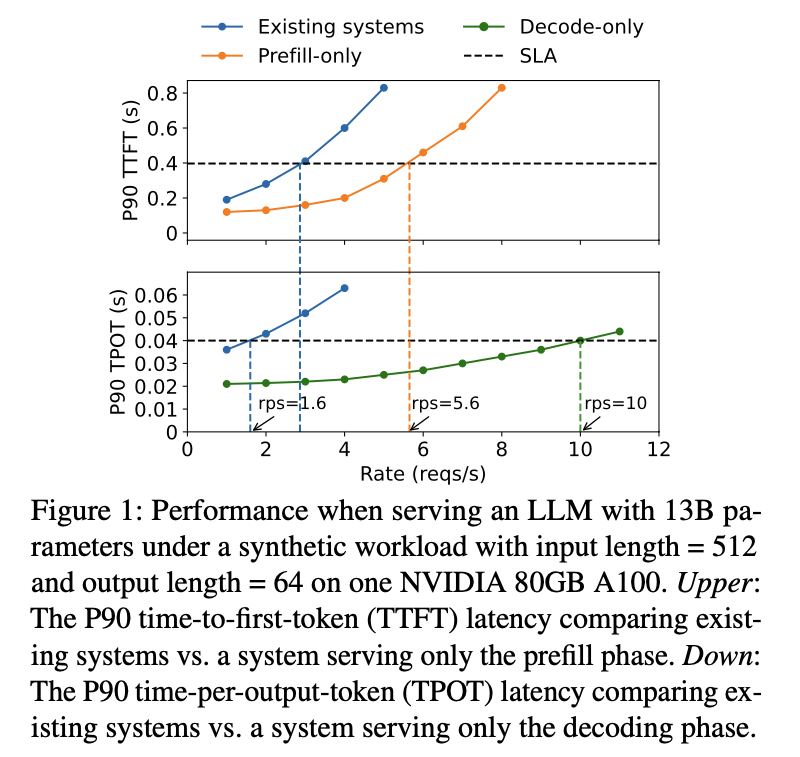

# DistServe: Disaggregating Prefill and Decoding for Goodput-optimized Large Language Model Serving

Two phases with very distinct computational characteristics and latency requirements

## Motivation

Disadvantages of Colocation: Strong prefill-decoding interference

