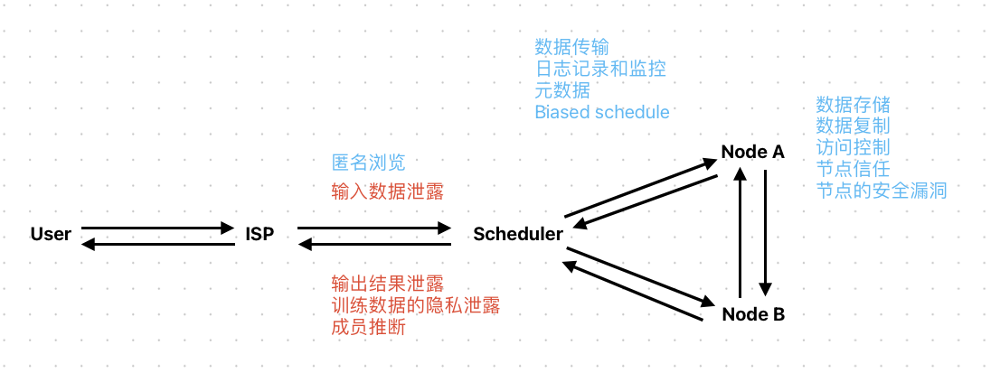
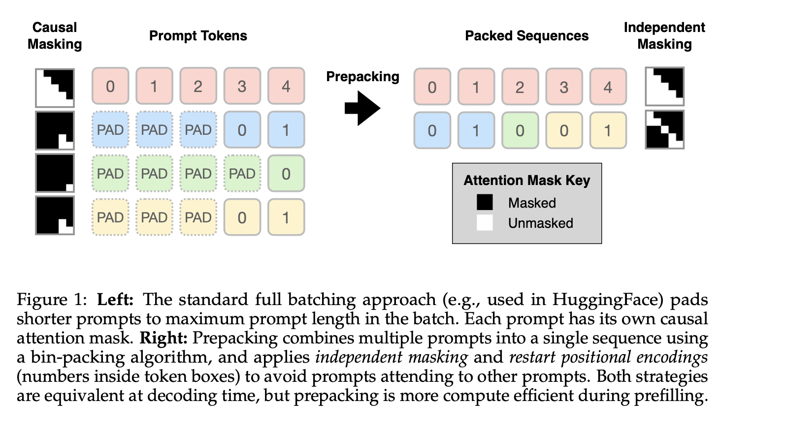
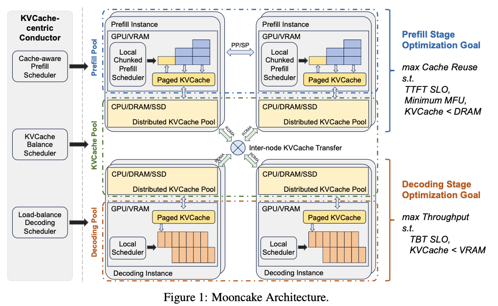
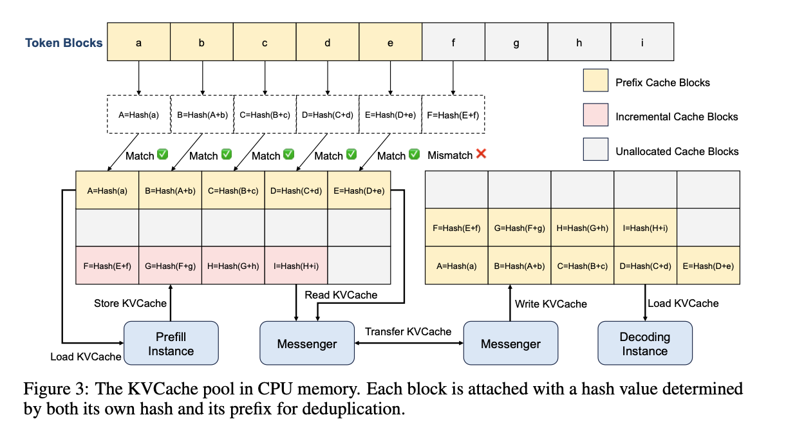
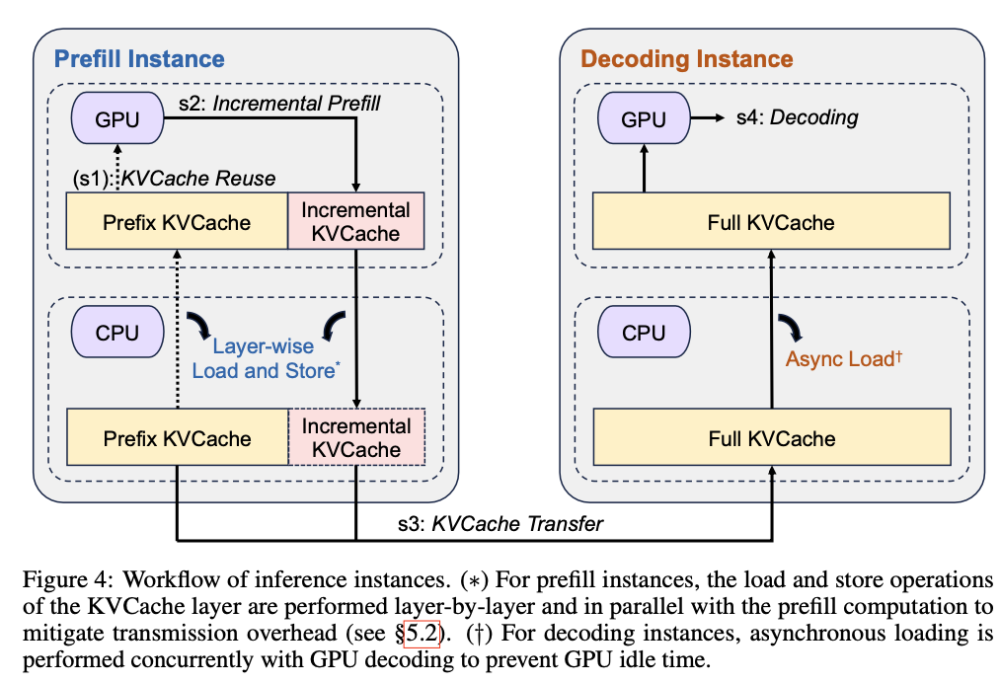
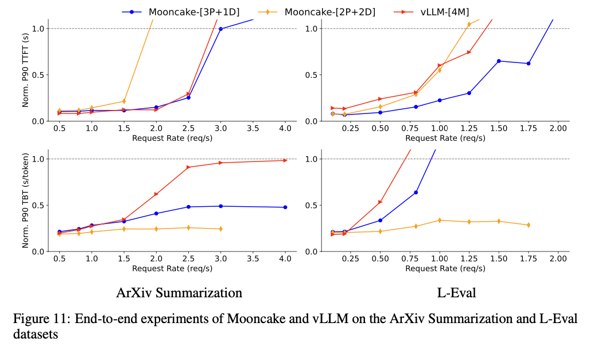

# 0731 Daily Notes

## Improved Taxonomy of Privacy Breach

> Blue: Traditional Server-Side Breach
> 
> Red: LLM-Serving Breach

## Papers Cited Sarathi

### Prepacking- A Simple Method for Fast Prefilling and Increased Throughput in Large Language Models

- Focus on the prefilling of the model
- Simple method by packing multiple prompts into a single prompt

### Mooncake: A KVCache-centric Disaggregated Architecture for LLM Serving

- 月之暗面，清华大学
  

#### Evaluation

<https://github.com/kvcache-ai/Mooncake>

<https://zhuanlan.zhihu.com/p/705754254>

### MemServe: Context Caching for Disaggregated LLM Serving with Elastic Memory Pool

- Huawei Cloud
- The core of MemServe is a distributed MemPool that manages KV caches across distributed instances. MemServe builds con- text caching, disaggregated inference, and their combo using MemPool APIs.
