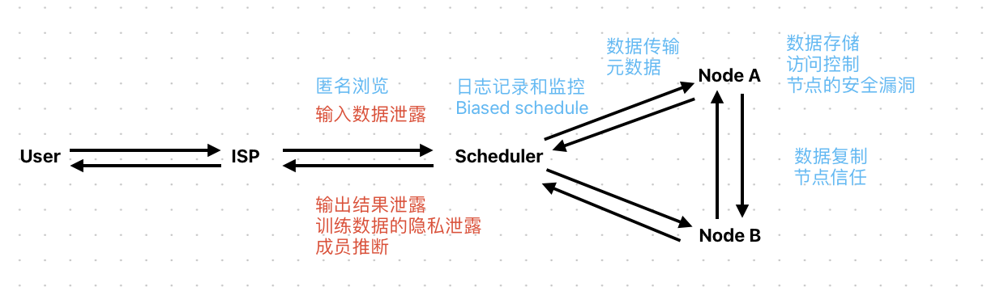
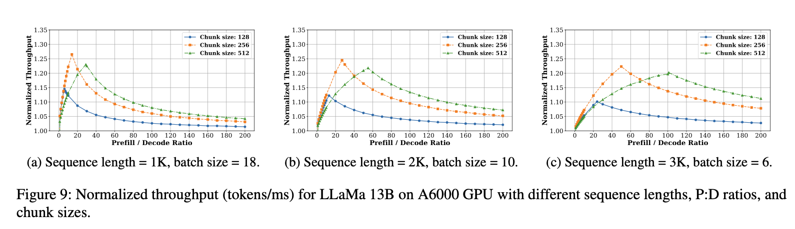
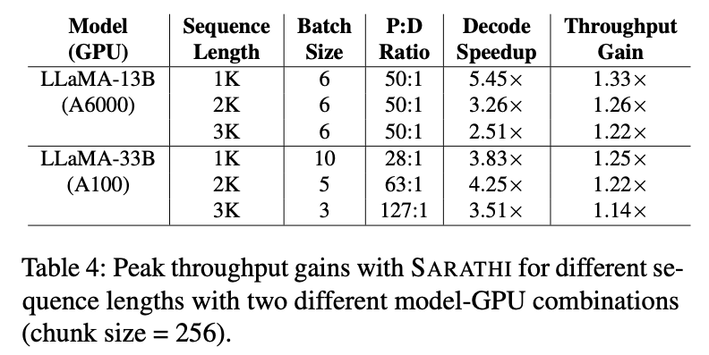
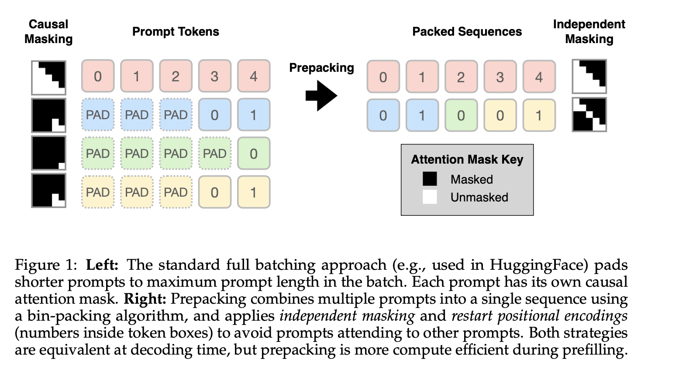
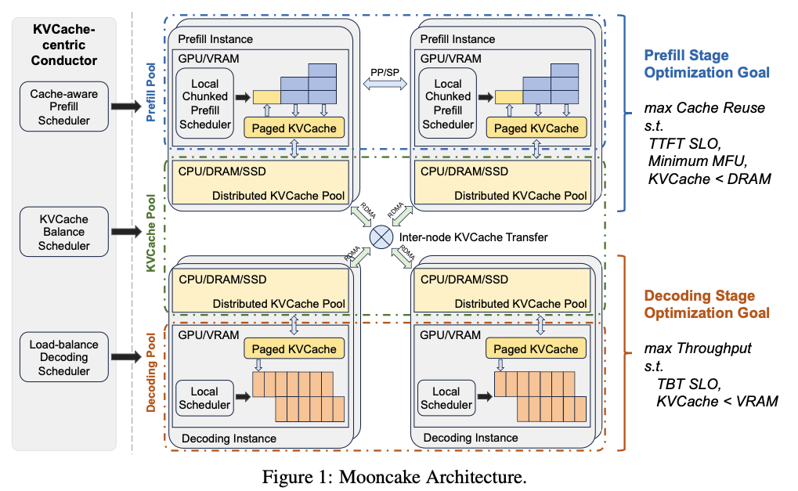
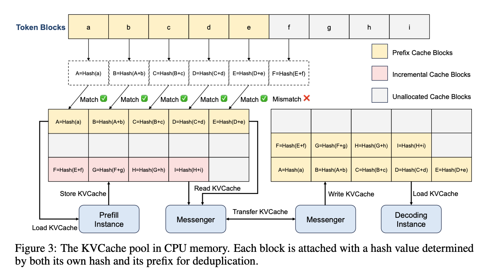
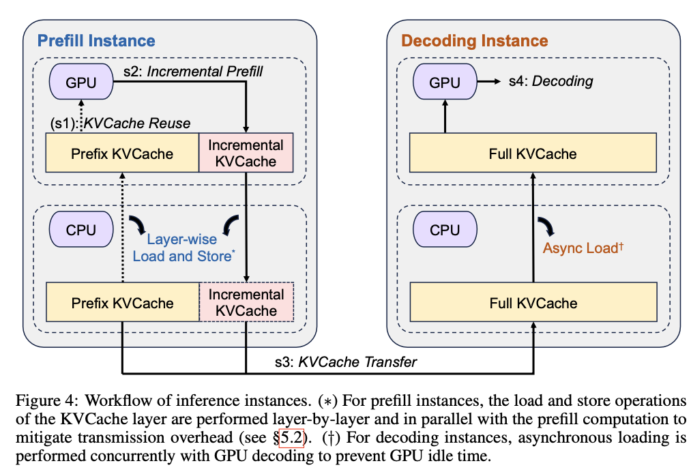
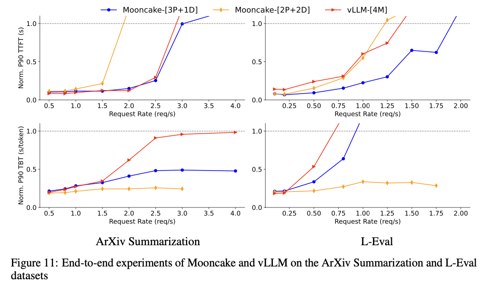

# 0731 Daily Notes

## Improved Taxonomy of Privacy Breach

> Blue: Traditional Server-Side Breach
> 
> Red: LLM-Serving Breach

## Papers Cited Sarathi

### SARATHI- Efficient LLM Inference by Piggybacking Decodes with Chunked Prefills

方案没有太大差别，更详细一点。

#### Chucked Prefill

- 讲了一下QKV里面Query矩阵的实现
- Batch size (# of queries) 的具体计算
$$
B = \lfloor \frac{M_G-M_S}{L*m_{kv}} \rfloor
$$

> $M_G$: available GPU memory
> 
> $M_S$: model's parameter memory requirement
> 
> $L$: max sequence length
> 
> $m_{kv}$: memory for each KV matrix pair

- chuck size 的计算

根据预期的 P：D 的比例，可以计算出最终的 batch size。小的size，可以并行处理更多decode，但是会降低prefill的效率。

最好可以是 tile 的整倍数，避免性能滑坡。

#### Stall-Free Decode

- 原先的名字叫Piggybacking decodes with prefills. 仍然是强调在单个 chuck 里面，decode 拥有更高的优先级，附带会加入一些 prefill，从而保证decode 不会被阻塞。

### Prepacking - A Simple Method for Fast Prefilling and Increased Throughput in Large Language Models

- Focus on the prefilling of the model
- Simple method by packing multiple prompts into a single prompt

### Mooncake: A KVCache-centric Disaggregated Architecture for LLM Serving

- 月之暗面，清华大学
  

#### Evaluation

<https://github.com/kvcache-ai/Mooncake>

<https://zhuanlan.zhihu.com/p/705754254>

### MemServe: Context Caching for Disaggregated LLM Serving with Elastic Memory Pool

- Huawei Cloud
- The core of MemServe is a distributed MemPool that manages KV caches across distributed instances. MemServe builds con- text caching, disaggregated inference, and their combo using MemPool APIs.
