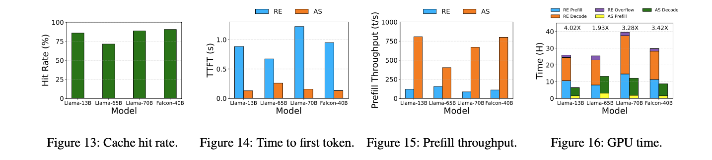

# AttentionStore - Cost-effective Attention Reuse across Multi-turn Conversations in Large Language Model Serving


Huawei Cloud, Chengdu

## Motivation

Multi-turn Conversation

$$
q_{1}a_{1}q_{2}a_{2}\dots q_{n-1}a_{n-1}q_{n}
$$

In ShareGPT dataset, 73% of the conversations are multi-turn. 30% of conversations have more than 4K tokens 


> we observe that if the KV caches can be reused across multiple turns of conversations, up to **98%** of prefilling cost can be reduced

## AttentionStore Architecture


## Evaluation

```
4 NVIDIA A100 GPUs, each with 80GB GPU memory
128 GB DRAM and 10 TB SSDs.
```

PyTorch

Compared with recomputation(RE)



