# DistServe: Disaggregating Prefill and Decoding for Goodput-optimized Large Language Model Serving

Two phases with very distinct computational characteristics and latency requirements

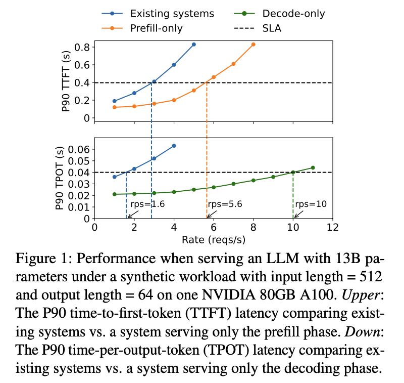

## Optimization Strategies

- Batching
- Model Parallelism
  - Tensor Parallelism, Intra-operator Parallelism (操作符内并行)
  - Pipeline Parallelism, Inter-operator Parallelism (操作符间并行)

## Motivation

### Strong prefill-decoding interference

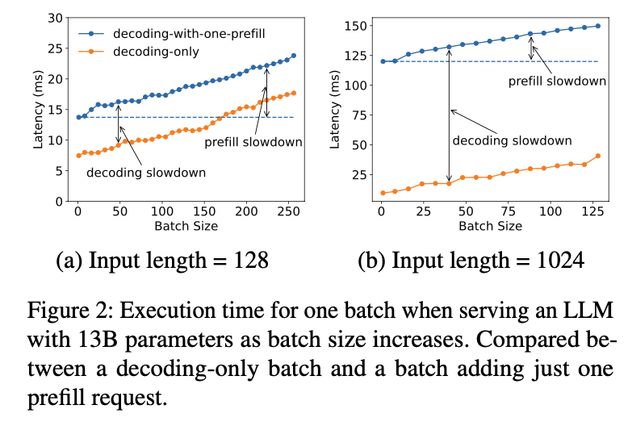

The decoding tasks in the batch must wait for lengthier prefill jobs to complete, thus extending TPOT; the slowdown intensifies with a longer prefill, shown in Figure 2(b). Adding decoding jobs to prefill also increases the time to complete the prefill task, particularly when the GPU is already at capacity

### Ineffective scheduling

### Resource and parallelism coupling

The prefill phase benefits from more GPUs and intra-op parallelism(tensor parallelism) to reduce execution time to meet the tight SLO on TTFT

> Q: How to allocate resources to the prefill and decoding phases to maximize throughput?

## Heterogeneous Computational Patterns

### 1. Prefill

#### 1.1 Batching

> Assuming a given arrival rate, our goal is to fulfill the service’s latency requirement on TTFT using the least resources.

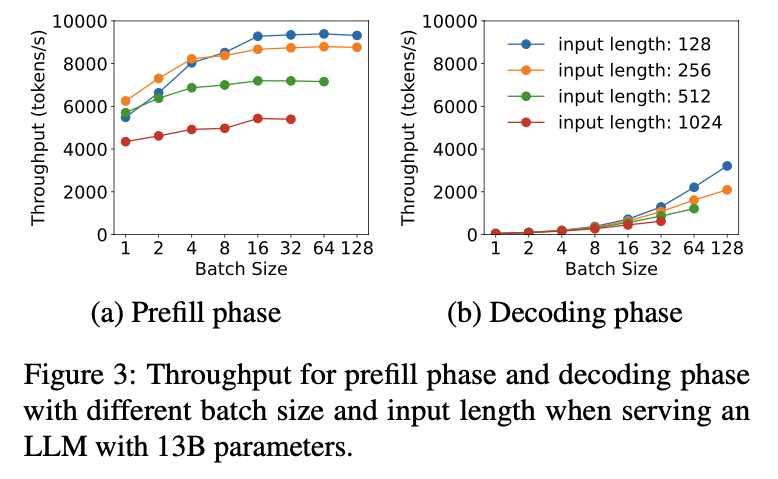

$L_M$,

beyond this threshold, the prefill phase becomes compute-bound.

#### 1.2 Model Parallelism

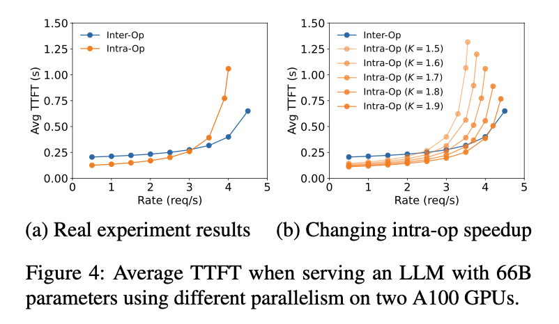

Intra-op(tensor) parallelism is more efficient at lower arrival rates, while inter-op(pipiline) parallelism gains superiority as the rate increases.

> In some simulation or estimation models, a fractional K value represents an average or estimated level of parallelism. For example, K=1.9 might be based on statistical data or model predictions, rather than an exact count of operator instances.

Queuing Theory

##### M/D/1 queue

> The M/D/1 queue is a model used in queuing theory to analyze systems where entities (such as customers or tasks) arrive at a service facility and are served. Here’s what each component represents:
>
> M: Stands for “Markovian” or “Memoryless,” referring to a Poisson arrival process. In this model, arrivals occur randomly over time and follow a Poisson distribution, which means that the time between arrivals follows an exponential distribution.
>
> D: Stands for “Deterministic,” which means that the service times are constant and predictable. Every entity requires the same amount of time to be serviced.
>
> 1: Indicates that there is a single server in the system.
>
> In summary, the M/D/1 queue model describes a queuing system where entities arrive according to a Poisson process, the service time is deterministic and constant, and there is only one server providing the service. This model is used to analyze performance metrics such as average waiting time, queue length, and system utilization.

$R$ is the Poisson arrival rate. It represents the average rate at which customers or requests arrive at the queue. Specifically, $R$ is the average number of arrivals per unit time.

Under condition $RD < 1$.

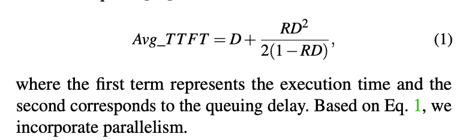

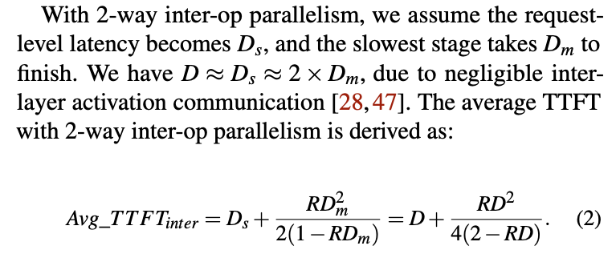

> Speedup coefficient K, where 1 < K < 2, reflecting the imperfect speedup caused by high communication overheads of intra-op parallelism.

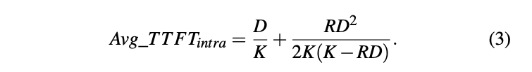

### 2. Decoding

#### 2.1 Batching

batching is key to avoiding low GPU utilization (hence high per-gpu goodput)

#### 2.2 Model Parallelism

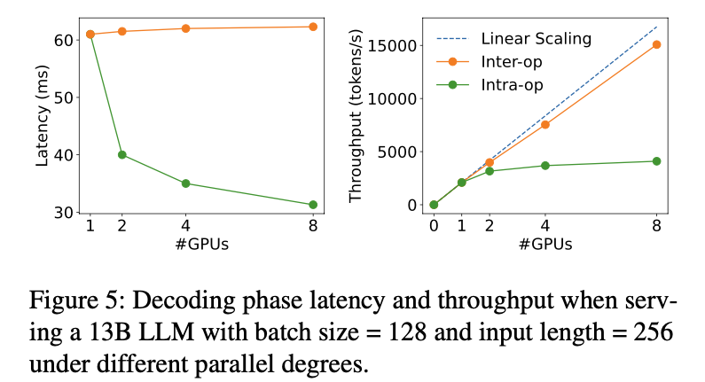

### 3. Summary

| Strategy | Metric | Prefill | Decoding |
| --- | --- | --- | --- |
| Batching | Throughput | $\nearrow_{L_M}$ | $\nearrow_{Thr}$ |
| Intra-Op Parallelism | Latency | Lower arrival rates| $\searrow_{Thr}$ |
| Inter-Op Parallelism | Latency | Higher arrival rates | Throughput $\nearrow$ |

## Challenges

| Challenge | DistServe | Sarathi-Serve | 
| --- | --- | --- |
| Variable prefill length | Workloaded-based batch, with a total sequence length close to $L_m$ | Chucked prefill |
| Communication overhead | Affinity-based cluster | N/A |
| Bursty arrival | Pull KV caches as needed | Accept requests based on budget |

Disaggregating prefill and decoding requires the transmission of KV cache across nodes, which can be a bottleneck.

## Solution

On high node-affinity clusters equipped with Infiniband, KV caches transmission overhead across nodes is negligible

### Placement for High Node-Affinity Cluster

Real-testbed profiling is time-prohibitive.

Generate trace based on historical data.

One node contains multiple GPUs.

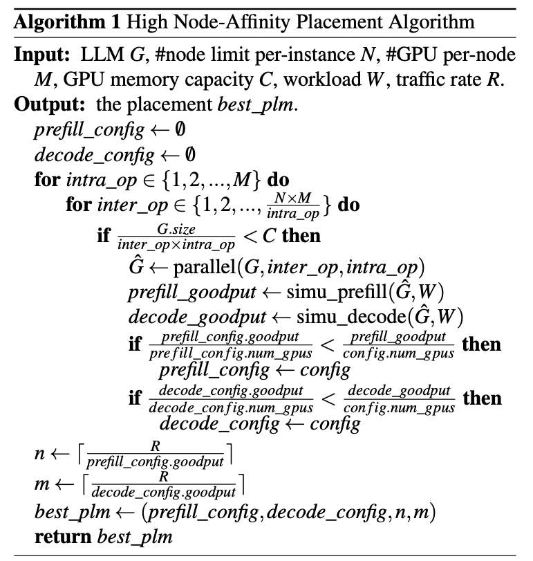

### Placement for Low Node-Affinity Cluster

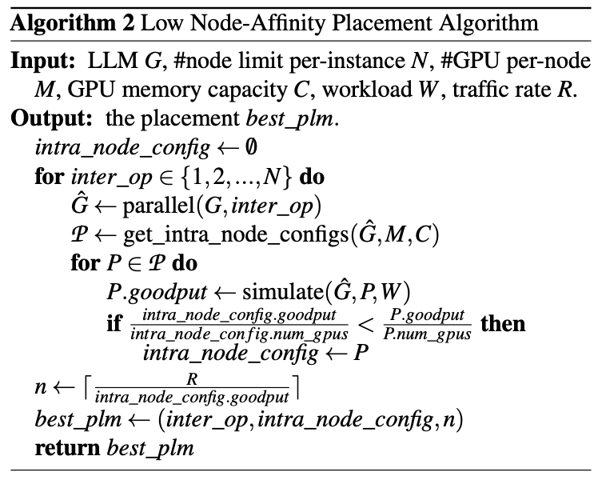

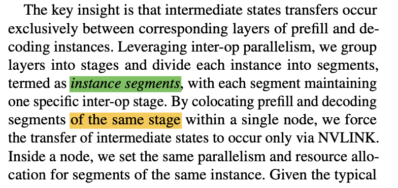

### Online Scheduling

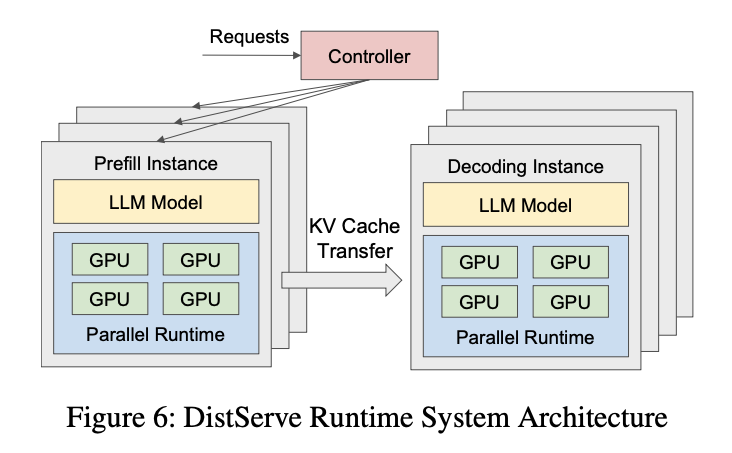

When workload pattern changes over time, the profiler monitor the system and adjust the placement.

## Evaluation

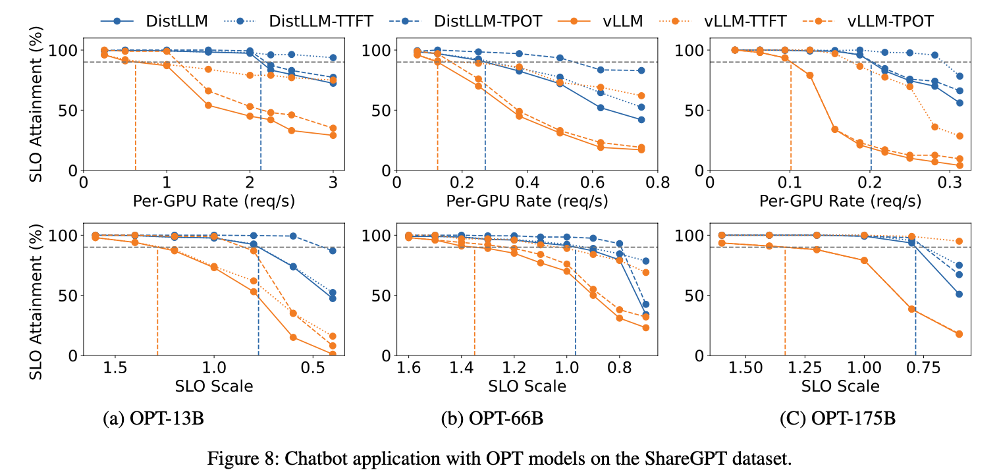

### Latency Breakdown

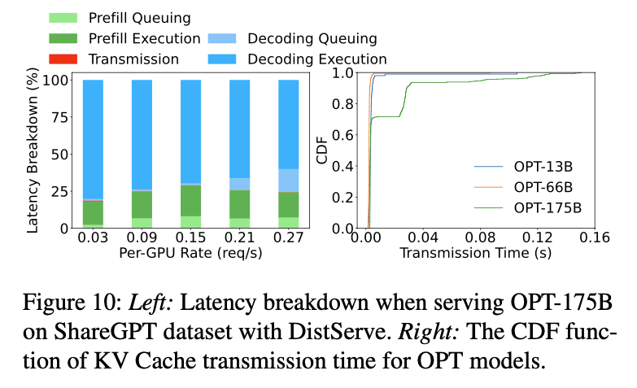