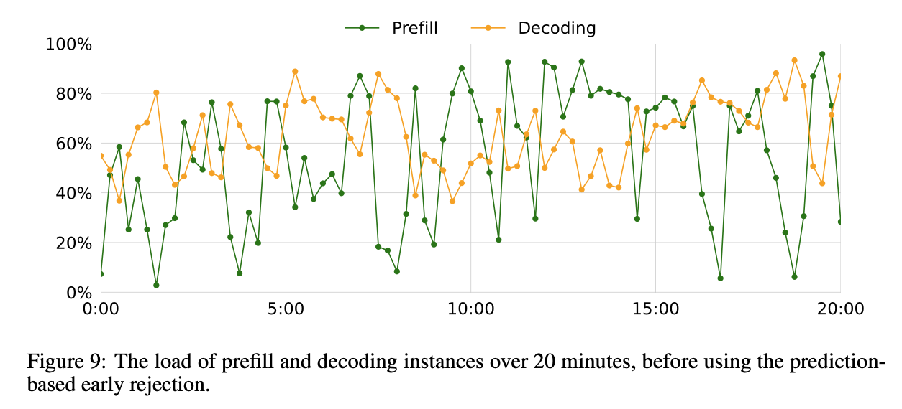

# Mooncake - A KVCache-centric Disaggregated Architecture for LLM Serving

## Architecture

## Prefill

### Parallelism

| Parallelism | Method | Ops/layer | Cons
| --- | --- | --- | --- |
| Tensor | 将张量分割 | 2 | 跨node的通信开销，导致计算资源利用率MFU降低
| Pipeline | 将阶段分割 | N/A | 同步开销，调度策略
| Sequence | 将输入序列分割 | 1 | 通信开销，可能破坏了一些依赖关系

mooncake 把 profile request 分成两组

1. TP Only
2. TP + SP, 相比于TP Only，能够用耕地的通信开销调用更多GPU来调度，从而满足满足 TTFO 的要求

PP的方面，对于较长的prefill，使用 chucked prefill。

### Layer-wise Prefill

Occupancy-aware prefilling

Spatial cost: S
Temporal cost: T

Occupancy cost: $ST$

Observation:
1. Prefill is compute-bound, this optimization is to also minimize the VRAM usage.
2. KVCache 的存储可以分成 load 和 store 两个部分
3. 等到上一层的计算完成后，再去 load 和 store，会导致计算资源利用率降低

Optimization:
1. 通过预测计算时间来调度 load 和 store，在下一层开始计算之前提前load。当下一层开始计算的时候，刚好load完成，然后进行上一层的store

这里的latency是和不存储KVCache相比

## KVCache-centric Scheduling

### Prefill Global Scheduling

Load balancing

> Previous: # of assigned requests
>
> Now: prefix cache hit length, distribution of reusable KVCache blocks.

算法的核心是对于每一个profile请求，匹配得到best_prefix的长度。然后在每一个instance里，进行匹配（8-22行），如果匹配得到的长度高于best_prefix的一定比例，就估算transfer所需的时间，然后计算transfer(如果有)+queue+prefill的总时间。

最后找到一个prefill完成时间最短的instance，如果满足TTFT的要求，则accept，否则rejct（25-26行）。如果best_prefix的长度和prefill的prefix的长度高于阈值，就把prefill转移到instance（28-29行）

### Cache Load Balancing

Observations:
- 不同的prompt频率差别很大（系统提示词，用户输入文件）
- workloads 十分动态，变化很大（在distServe里面，他们假设访问有周期性）

## Overload-oriented Scheduling

> in real scenarios, processing every incoming request is neither economical nor realistic. 

### Scheduling in Overload Scenarios

> How to define the system load?

- Effective processed requests per second
- Bubbles, the time between two consecutive requests
- Rejected requests.

> How to define when the system is overloaded?

* When TTFT and TBT reach the threshold, the system is considered overloaded.

### Early Rejection

在decode阶段被reject的话，prefill的时间相当于被浪费了。所以在prefill之前就根据当前的load判断是否接受这个请求。

### Load Fluctuation Caused by Early Rejection

Root reason: the time lag between predicting the decoding load and its actual execution. Scheduling based on the current decoding load is inherently delayed.

#### Early Rejection Based on Prediction

Goal: predicts the decoding load after the prefill stage of incoming requests and uses this prediction to decide whether to accept the requests.

Challenges:
- the unknown output length of each request.

Solution:
- System-level prediction: predict the decoding load of the system. Assume the decoding state takes a uniform time $t_d$ (Maybe use moving avaerage to predict the decoding time?)

## Evaluation

Remember mooncake is a system for overloading scenarios.

### TTFT & TBT

### Reject Rate

## Related Work

Disaggregated architecture

Prefix caching

Hierarchical KVCache