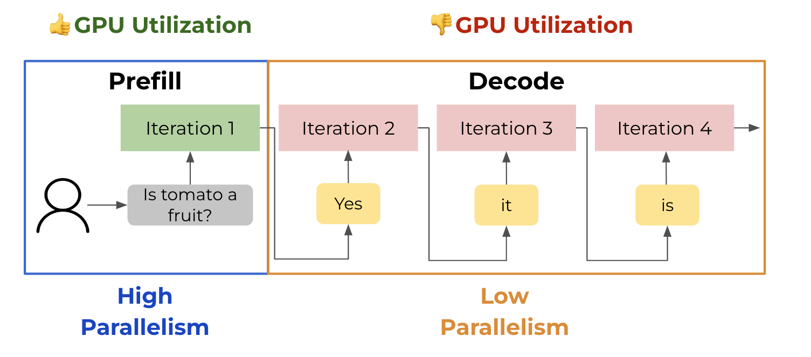
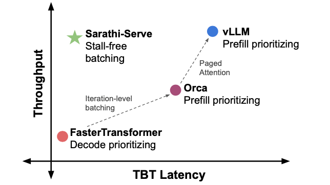
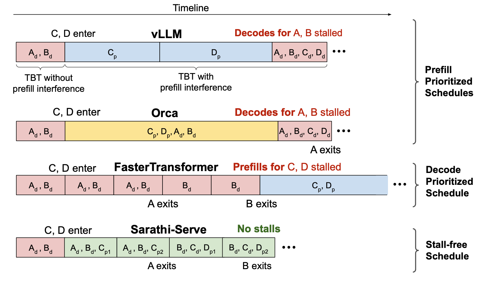
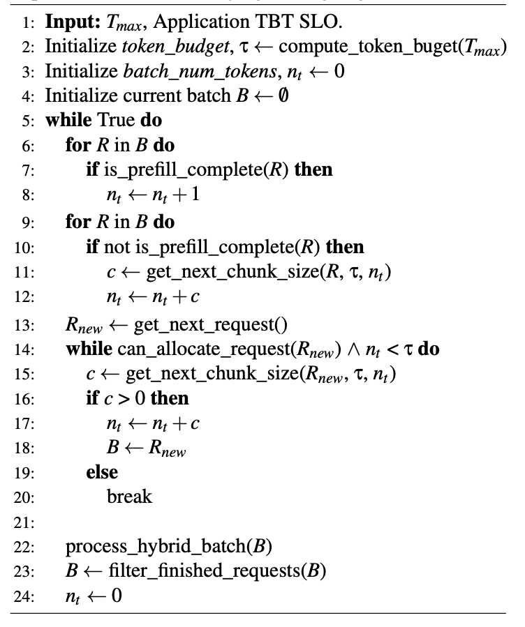
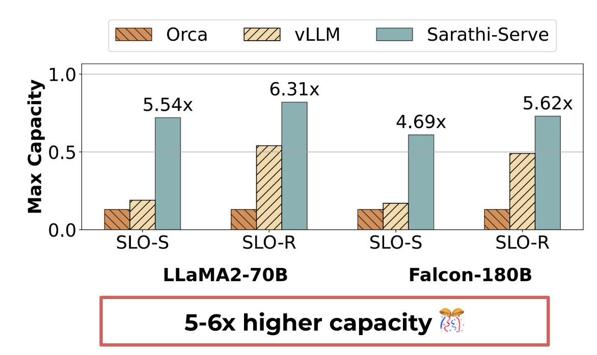

# Taming Throughput-Latency Tradeoff in LLM Inference with Sarathi-Serve

## 引言

本文提出了一种名为Sarathi-Serve的高效LLM推理调度器，以解决在LLM推理过程中常见的吞吐量和延迟之间的权衡问题。当前的LLM推理系统在处理多个请求时，由于预填充和解码阶段的交织，难以同时实现高吞吐量和低延迟。Sarathi-Serve通过创新的调度方法和系统设计，有效地优化了这两者之间的平衡。

## 背景与挑战

### 预填充与解码阶段

LLM推理请求通常分为两个主要阶段：预填充(Prefill)和解码(Decode)。预填充阶段负责处理整个输入提示并生成第一个输出令牌，通常具有高延迟但能够充分利用GPU的计算能力。解码阶段则生成剩余的输出令牌，尽管其计算利用率较低，但延迟相对较低。

### 当前系统的局限性
现有系统在批处理多个请求时，为了降低延迟，通常会选择优先处理解码阶段。然而，这种策略会导致预填充操作被阻塞，从而降低了计算利用率，影响了整体性能。此外，由于预填充和解码操作之间的交织，系统往往难以同时实现高吞吐量和低延迟。

## Sarathi-Serve的设计与实现
### 分块预填充
Sarathi-Serve通过引入分块预填充技术，将预填充请求分成大小接近的块。每个块可以独立处理，从而更好地平衡GPU的负载，提高计算利用率。通过这种方法，系统能够在不显著增加延迟的情况下处理更大的批量大小，从而提高吞吐量。

下图对比不同系统的调度策略，展示了分块预填充如何消除生成停顿并提高吞吐量。示例展示了四个请求 A、B、C 和 D 的时间线（从左到右）。在时间间隔开始时，请求 A 和 B 处于解码阶段，一次迭代后，请求 C 和 D 进入系统。

#### vLLM

- 预填充优先调度（Prefill Prioritized Schedules）
- 存在生成停顿：当 C、D 请求的预填充操作插入到 A、B 的解码迭代之间时，导致请求 A、B 生成停顿。
- A、B 请求在预填充时被暂停，只有预填充完成后才继续解码。

#### Orca

- 同样采用预填充优先调度
- 尽管支持混合批处理，仍然存在生成停顿：长提示词的批处理执行时间高，导致解码操作被阻塞。

#### FasterTransformer

- 解码优先调度 （Decode Prioritized Schedules）
- 无生成停顿：所有正在进行的解码操作在新预填充前完成。
- 缺点是低吞吐量：由于预填充操作被阻塞，导致解码的并行度较低，影响了整体性能。

#### Sarathi-Serve(本文)

- 采用分块预填充策略：将预填充请求分成更小的块（如C的预填充被分为$C_{p1}, C_{p2v}$）,可以减少每次预填充操作所需的时间，从而避免长时间阻塞解码操作。

- 并行调度：通过将预填充和解码段结合在一起，系统可以并行处理多个请求的不同阶段，避免了请求之间的相互干扰。

### 无停顿调度
无停顿调度允许新请求在不打断正在进行的解码操作的情况下加入批处理中。在每次迭代中，系统首先将所有正在进行的解码操作放入下一个批处理中(6-8行)，并可以选择性地包含部分已完成的预填充操作(9-12行)。接着，系统检查新的请求分块的大小是否能被容纳，如果可以，则将其加入到分块中(13-20行)。

这种调度策略通过动态调整批处理队列，使系统能够高效地处理不断到来的新请求，提升系统的响应能力和资源利用率，并通过限制每次迭代的计算负载，减少了生成停顿的情况。

## 性能评估

### 测试模型与硬件
测试在不同的LLM模型（如LLaMA2-70B、Falcon-180B）在 A100 上进行。通过这些测试，验证了Sarathi-Serve在各种配置下的性能提升效果。

### 结果与分析
在A100 GPU上运行的LLaMA2-70B模型中，对于openchat_sharegpt4数据集，在严格(S)和宽松(R)的延迟约束下，相比于Orca，Sarathi-Serve的服务能力分别提升了5.54倍和4.69倍。在Falcon-180B模型上，Sarathi-Serve的服务能力分别提高了6.31倍和5.62倍。

