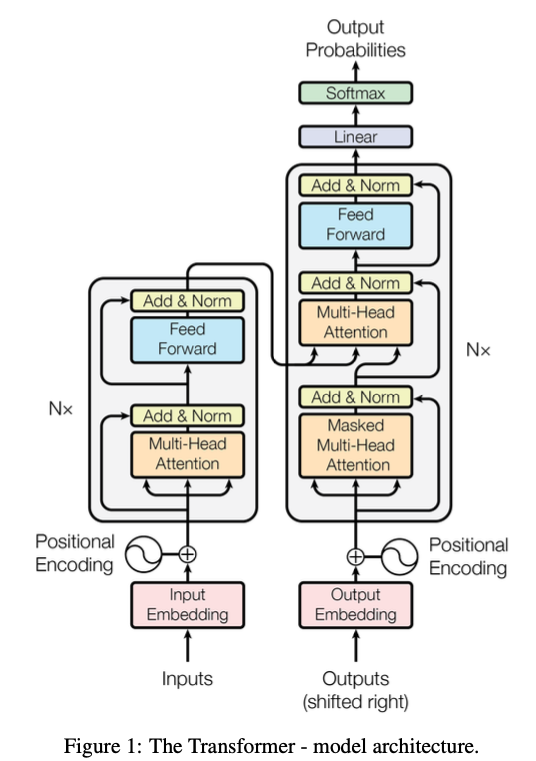
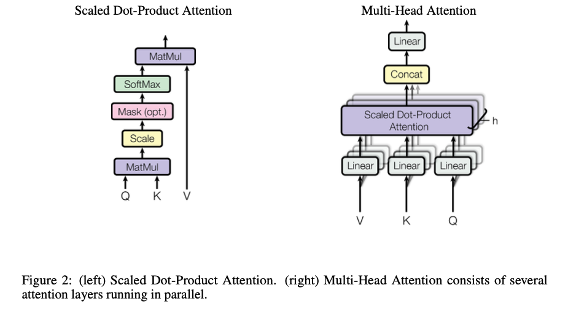

# Attention Is All You Need

## Architecture

## Encoder

### Multi-Head Self-Attention Mechanism
这个机制可以让模型在计算每个词的表示时考虑到序列中其他所有词的重要性，从而捕捉到全局信息。通过多个注意力头，模型可以关注不同的特征子空间。

1. Query（Q）查询

- 作用：查询向量用于在整个输入序列中寻找相关信息，类似于在信息检索系统中输入的查询。
- 来源：在自注意力机制中，每个输入向量都会被映射成一个查询向量 Q，用于寻找与其相关的其他向量。

2. Key（K）键

- 作用：键向量用于表示序列中每个向量的特征，类似于数据库中的键，用于查找和匹配相关信息。
- 来源：每个输入向量也会被映射成一个键向量 K，用于与查询向量 Q 进行匹配和计算注意力得分。

3. Value（V）值

- 作用：值向量表示实际要被关注的信息，即在查询和键匹配后，值向量会根据注意力得分进行加权求和，生成新的表示。
- 来源：输入向量还会被映射成一个值向量 V，表示具体的内容信息，在计算注意力权重后，用于加权求和产生输出。

> 假设有一个输入句子 “The cat sat on the mat”：
> - 对于单词 “cat”，查询向量 Q 可能会去寻找与其相关的动作（如 “sat”）。
> - 键向量 K 代表每个单词的特征，用于匹配查询。
> - 值向量 V 是每个单词的实际内容信息，在注意力计算后，“cat” 可能会关注 “sat” 的值向量，从而得到新的表示。

$$
\text{Attention}(Q, K, V) = \text{softmax}(\frac{QK^T}{\sqrt{d_k}})V
$$

$$
a_{i j}=\frac{\exp \left(q_{i}^{\top} k_{j} / \sqrt{d}\right)}{\sum_{t=1}^{i} \exp \left(q_{i}^{\top} k_{t} / \sqrt{d}\right)}, o_{i}=\sum_{j=1}^{i} a_{i j} v_{j}
$$

### Feed-Forward Neural Network, FFNN
每个位置上的向量通过一个前馈神经网络，该网络由两个线性变换和一个ReLU激活函数组成。

## Decoder

1. 掩码多头自注意力机制（Masked Multi-Head Self-Attention Mechanism）：这个机制类似于编码器的自注意力机制，但会屏蔽未来位置的信息，以防止模型在生成某个位置的词时看到未来的词。
2. 编码器-解码器注意力机制（Encoder-Decoder Attention Mechanism）：解码器的每一层有一个额外的注意力子层，用于关注编码器输出的中间表示，从而利用输入序列的信息生成输出序列。
3. 前馈神经网络（Feed-Forward Neural Network, FFNN）：与编码器中的前馈神经网络相同。

## Positional Encoding

由于自注意力机制并不包含序列中单词的相对或绝对位置信息，因此需要添加位置编码向量。这些向量可以直接添加到输入的词向量中，以表示单词在序列中的位置。

$$
PE_{(pos, 2i)} = \sin(pos / 10000^{2i / d_{\text{model}}})\\
PE_{(pos, 2i+1)} = \cos(pos / 10000^{2i / d_{\text{model}}})
$$

用 sin：

1. 表示唯一
2. 分布有界，空间连续，更容易泛化

用 sin + cos

相当于把位置信息编码成了一个高维空间中的一个点，更好的进行线性组合
