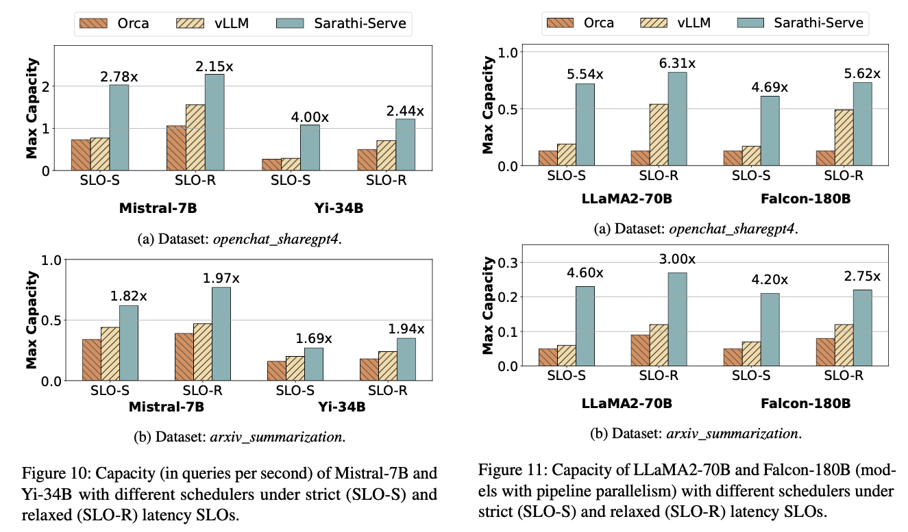

# Taming Throughput-Latency Tradeoff in LLM Inference with Sarathi-Serve

## Dual-Phase Process of LLM Services

An LLM service responds to a user query in two phases.

- The prefill phase processes a user’s prompt, composed of a sequence of tokens, to generate the first token of the response in one step.
- The decoding phase sequentially generates subsequent tokens in multiple steps; each decoding step generates a new token based on tokens generated in previous steps, until reaching a termination token.

## Performance Metrics

| Metrics | Formula | Description | Related phase |
| --- | --- | --- | --- |
| TTFT | time to first token | Initial responsiveness of the model | Prefill |
| TBT | time between tokens | Responsiveness of the model | Decode|
| Throughput | queries per second | Efficiency of the model | Both |

## Characteristics of Each Phase

## Optimization Strategies: Batch

**Improve memory efficiency**: Batching multiple queries together can improve throughput by amortizing the overhead of fetching model parameters and intermediate states over multiple queries.

## Existing Approaches

Larger batch sizes can lead to increased latency.

Batching can suffer from bubble latency, where the last query in a batch experiences higher latency than the rest.

## Optimization 1: Chucked-Prefill

Naively, this can be done by creating hybrid batches which combine the memory bound decodes along with compute bound prefills

## Optimization 2: Stall-free batching

First calculates the budget of maximum number of tokens that can be executed in a batch based on user specified SLO.

Only after all the running requests have been accommodated, we admit new requests. By restricting the computational load in every iteration, stall-free batching ensures that decodes never experience a generation stall due to a co-running prefill chunk.

Pros:

- reduce bubble sizes.
- largely free of latency spikes.

Cons:

- overhead: increased memory reads from the GPU HBM, due to repeated KV-cache access in the attention operation.

  - even at small chunk sizes attention prefill operation is compute bound operation

  

Solution:

one-time profiling of batches with different number of tokens and setting the token budget to maximum number of tokens that can be packed in a batch without violating TBT SLO.
> Note: matmuls achieve maximum GPU utilization when the matrix dimensions are divisible by the tile size, e.g., in some cases, using chunk size of 257 can increase prefill time by 32% compared to that with chunk size 256.

## Evaluation

<https://github.com/microsoft/sarathi-serve>

### W/ Tensor Parallelism

